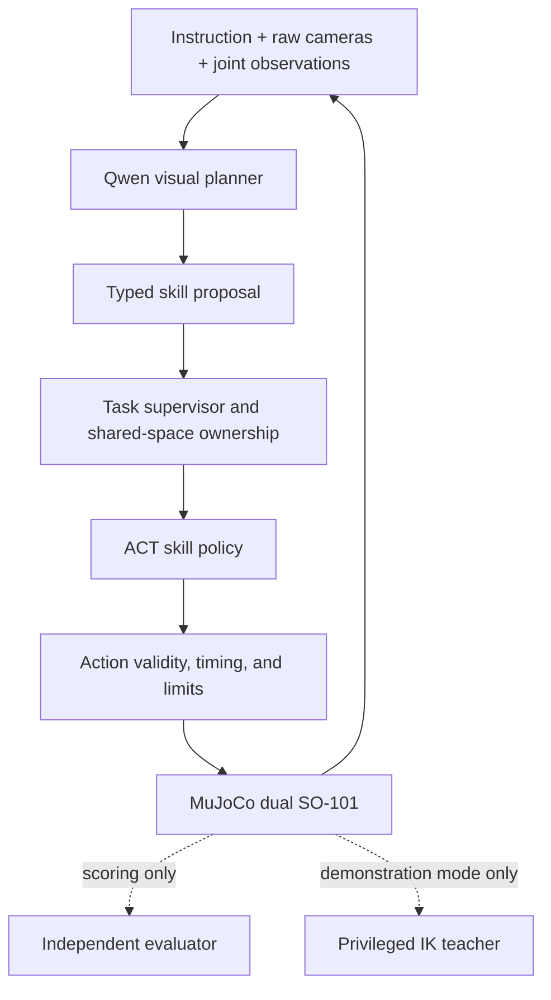

# Architecture and implementation boundaries

## Current preparation system

`bimanual lab` runs a generic single-hinge pendulum, writes actual observations and
actions to CSV, and seals its scene/config/replay. `doctor` tests the environment.
The local portal reads project status and verifies artifacts before showing them.
It cannot start training or send robot actions. SQLite is a rebuildable index;
manifests are the authoritative run records.

The [dual-arm foundation](DUAL_ARM_FOUNDATION.md) now implements the simulator,
synchronous joint-target validation, and three-camera observations. `bimanual sim`
records its free-space demonstration; task planning and learned execution below
remain unimplemented.

`bimanual grasp` adds a privileged IK teacher and contact-only block experiment.
Scratch-state IK never edits the live object's state. Per-step collision guards
and force/pose scoring run at 200 Hz; truth is stored separately from the joint
observation/action trace. This first teacher records replay, not a training dataset.
See [the contact experiment contract](CONTACT_GRASP.md).

## Target manipulation system (partially implemented)

ACT predicts movements; it is not intrinsically a language-reasoning model.
Qwen handles language and visual task state. The supervisor controls execution
semantics. This distinction must remain visible in technical claims.

## Interface specification for M1/M2

| Interface | Required contract |
|---|---|
| ObservationV1 | Episode/sequence identity, simulation and monotonic timestamps, named RGB cameras, joint position/velocity, current instruction |
| SkillRequestV1 | Supported skill, semantic target, assigned arm(s), expected visible completion condition, instruction revision |
| ActionChunkV1 | Originating observation/instruction revision, ordered joint targets, timing, normalization identifier, policy digest |
| RunResultV1 | Terminal outcome/reason, requested and completed steps, retries/interventions, collisions, independent success, lineage |

Both SO-101 instances have five arm joints plus one gripper actuator. The target
interface orders all six left channels followed by six right channels. Preserve
the model's hinge radians and actuator bounds; any normalized gripper mapping must
be explicit, invertible, and tested. Do not assume an unconstrained 6-DOF wrist.

Model input excludes exact object poses, semantic simulator labels, and evaluator
completion flags. The teacher may use them in a separately labeled data-generation
mode. Runtime safety access to simulator contacts must be documented and must not
be used to supply hidden object poses to the policy.

Fresh camera observations are required at step changes and retries. A new
instruction or cancellation invalidates queued actions. Joint limits, invalid
values, stale observations, and workspace conflicts prevent action application.
No fallback silently changes the model, backend, precision, or task semantics.

## Component scope

V1 runs on one workstation with one simulation worker. Local browser access comes
first. No fleet management, physical motor SDK, Kubernetes, or paid inference
dependency is introduced. Remote training is an execution-location setting, not
a new dataset format. The final Intel run includes all inference locally there.
