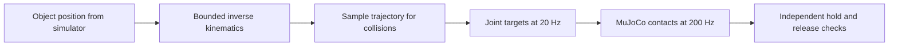

# First contact grasp on your Mac

This is the first manipulation experiment: the left SO-101 reaches for a small
block, closes its fingers, lifts, holds, optionally carries it to a new position,
lowers, opens, and retreats. Either arm can execute this skill; the other arm
holds its home pose and cannot receive movement commands. It runs on the local CPU; no Intel machine, paid
service, physical robot or model download is needed.

## Run and inspect

From the verified native environment:

```sh
.venv/bin/bimanual grasp
.venv/bin/bimanual grasp --destination -.15 .08
.venv/bin/bimanual grasp --arm right --destination .15 -.08
.venv/bin/bimanual serve --port 8768
```

If the local portal already runs, refresh it instead of starting another server.
Open the replay in the run history. The three panels are overhead, left wrist and
right wrist. The label above them names the current stage and simulation time.
Use `bimanual grasp --no-render` for a fast physics-only check.

Try deliberate failures:

```sh
.venv/bin/bimanual grasp --fault missing-object --no-render
.venv/bin/bimanual grasp --fault skip-close --no-render
```

Both should return a failed result and a nonzero exit status. Missing object stops
before movement. Skip-close stops after the two-second hold fails. Neither should
report a completed grasp. Every command returns an integrity-checkable run ID:

```sh
.venv/bin/bimanual evidence verify RUN_ID
```

## What the teacher does



Inverse kinematics converts a desired finger position into joint angles. This arm
has five positioning joints, so the solver constrains position and a downward
approach direction, while leaving rotation around that direction free. It uses a
separate scratch simulation state to solve geometry. Only motor targets advance
the live experiment; the object has a free joint, gravity and contact response.
There is no weld, attachment, object actuator, gravity compensation or teleport.

The teacher intentionally reads the exact object position. This is privileged
training-teacher access, not visual reasoning. Its code is isolated in
[`teacher.py`](../src/bimanual/teacher.py). The future learned policy must infer
movement from allowed images/joints, without receiving this object position.

## Acceptance envelope

The default object is a 20 × 20 × 32 mm box of 25 g, placed at world coordinates
(-0.15, -0.08, 0.391) m on the existing workbench. Robot dynamics and upstream assets
are unchanged. A separate pinch site is added at local (0.008, -0.000218, -0.09) m
in each gripper frame. It is a kinematic reference, not a constraint. The mirrored
right-arm pickup starts at (0.15, 0.08, 0.391) m. Destinations are world-frame
XY metres; the selected arm must reach both the elevated and release poses.

A pass requires:

- All 400 physics samples of the two-second hold have at least 4 cm of lift,
  contact force above 0.01 N from both jaws, and no table contact.
- All 400 samples of the final two-second settling phase have table support,
  no jaw contact forces, position within 3 cm horizontally and 4 mm vertically
  of the starting location, speed below 1 cm/s and angular speed below 0.1 rad/s.
- No forbidden contact anywhere in the run, and contact overlap at most 2.5 mm.
- When a distinct destination is requested, all 600 physics samples of the
  three-second transport must retain bilateral airborne support; final settling
  must be within 2 cm horizontally and 4 mm vertically of that destination.

The overlap limit is a bound on this compliant simulation model, not physical
validation. Gripper contact uses the original model's friction and actuator force
limits. A short drop onto the support surface is allowed during release. This is
a transport task only when an explicit distinct destination is requested.

The trajectory checker samples joint interpolation every at most 0.02 rad. The
runtime checks contacts after every 5 ms physics step and stops on prohibited
robot-table, robot-robot or non-gripper object contact. This is discrete collision
checking, not a continuous-motion safety proof. Simulator-derived pose and force
values are refreshed at the recorded physics timestamp.

## Evidence and limits

`observations.jsonl` contains joint observations and commanded actions at 20 Hz.
`scoring-truth.jsonl` separately contains object pose, free-joint velocity
(translation m/s then rotation rad/s), jaw forces, contact pairs and penetration at
200 Hz. Object truth never enters the observation record. This experiment records
camera replay at 10 Hz to reduce local rendering cost. An optional raw recording
adds all three cameras at 20 Hz for later LeRobot export:

```sh
.venv/bin/bimanual grasp --destination -.15 .08 --record-demo --seed 0 --split train
```

This writes `demonstration/episode.json` and lossless RGB PNGs. Each applied action
belongs to its preceding observation; the final observation has no action. A
failed partial physics step is excluded from training transitions and preserved
in ordinary failure evidence. Failed episodes are retained and rejected by the
success-only training intake. The seed is a lineage label only: no scene
randomization exists yet, and changing it does not create a new test condition.
See [interface and recording contracts](INTERFACES.md). Recording increases
wall-clock cost without changing the 20 Hz simulation interface.

Runs also contain a portable scene with licensed assets, configuration, joint
mapping, source digest, platform, outcome and timings. `grasp_success` describes
only this experiment; `manipulation_success` remains null for the unimplemented
full dinner workflow. Failed attempts remain visible and selectable in the portal.

The [experiment record](experiments/2026-09-10-contact-grasp.md) includes unsuccessful
geometry attempts and measured local results. One nominal success does not establish
robustness to different objects, poses, friction, or hardware.
The [placement register](experiments/2026-09-10-placement.md) records transport
attempts and the first synchronized demonstration. The separate [hand-off](HANDOFF.md)
uses a shared-workspace sequence and a longer object.

## Five-minute exercise with feedback

Read [Lesson 03](../lessons/0003-contacts-grasps-handoffs.html), then watch the replay.
Pause during **hold** and answer:

1. Is seeing the block between the fingers enough to prove a successful grasp?
2. Which three signals distinguish a held block from a block still on the table?
3. Does this result show that a learned policy can understand your instruction?

<details>
<summary>Check your reasoning</summary>

1. No. A single image can hide support, slip or a scripted attachment.
2. Sustained height above its starting position, bilateral finger contact force,
   and absence of table contact. The release also needs its own settling check.
3. No. This is a scripted teacher that reads simulator truth. ACT and the visual
   planner are later implementation stages.

</details>

Reading this walkthrough records exposure only. Demonstrated understanding is
recorded separately after you explain or complete an exercise.

References: [MuJoCo contact mechanics](https://mujoco.readthedocs.io/en/latest/computation/)
and [MuJoCo Jacobian functions](https://mujoco.readthedocs.io/en/stable/APIreference/APIfunctions.html#mj-jacsite).
