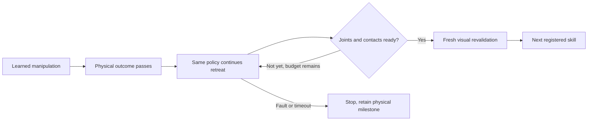

# From physical completion to the next learned skill

A placed object does not imply that the arms are ready for the next policy. The
recorded nominal workflow exposes gaps of 1.080203 rad at the bar transition and
0.551752 rad at the plate transition. A separate readiness check preserves this
distinction instead of silently starting the next checkpoint early.

`load_successor_reference(dataset_root, skill_views_path, skill_id=...)` verifies
training lineage and reads the measured joint posture at the successor's first
observation. It reads no operating targets from teacher actions. The immutable
reference records dataset/view/episode/observation digests and all twelve joints.
Load references and construct the executor before capturing live observations:
source verification can take seconds. The final fork has no successor; optional
final parking requires the loader's explicit `final_parking=True` argument.

`DinnerSkillExecutor(..., successor_reference=reference)` requires a matching
reference before starting any nonfinal task step. The reference must match the
checkpoint dataset, parent episode, current skill and registered next capability.
A final standalone skill can finish on its measured physical outcome; a provided
final parking reference adds a separate final-parking result.

When the physical monitor passes, the executor records `physical_success=true`
and keeps the same attempt, arm ownership and learned policy active. It continues
learned retreat under the existing contact, action, cancellation and timeout
checks. No reference joint values enter policy inputs or become motor targets.
Readiness consumes each confirmed action, all fifty 1 kHz physics samples, and a
fresh observation. It requires:

- All twelve joints within 0.005 rad of the verified entry reference.
- Measured joint speeds at most 0.02 rad/s for ten new consecutive observations.
- Continuous required contact/placement conditions through every physics sample,
  with valid limits, timestamps, episode, task revision and attempt identity.

These are explicit development-profile thresholds, not validated generalization
limits or organizer requirements. Hand-off must preserve receiver-only airborne
grip; placement transitions preserve all accepted placements. Drawer and utensil
transitions also preserve an open, released drawer. A failed invariant ends the
attempt. A timeout or readiness failure retains the physical-success milestone
but cannot advance the task. Queue exhaustion and elapsed time never certify
readiness. Fresh live planner revalidation is still needed before the next skill.

The combined gate and a new bar settling experiment have been checked against
retained physics evidence (results below). Existing datasets and failed runs are preserved. A
new teacher demonstration must pass the complete physical workflow before it can
be adopted; success at one transition is insufficient.

## Verified development results

Combined retained-teacher audit `20260911T041524-a18f4e1922da` is sealed and
verified: hand-off, cup, plate, drawer, spoon and final fork parking become ready.
The bar transition fails at its original view end with only six qualifying
observations. All intervening joint-limit/contact/placement checks passed for the
six ready cases. This is one existing training episode, not held-out performance.

Preregistered protocol `20260911T041036-91d3206eae36` adds exactly ten held
controls after original bar action 1569, preserving every original command and
asset. The new physics-only run `20260911T041046-acd11fe83176` **fails**: plate
rim17 contacts cabinet_right during withdrawal at simulation second 136.644.
The 1 kHz guard stops midway through the action and retains partial-action evidence.
This run cannot become a successful full-workflow demonstration.

The inserted hold separately measures maximum joint error 0.0000256 rad and
endpoint joint speed 0.0000672 rad/s, with bar placement preserved throughout
all 500 physical samples. No fresh cameras were captured, so this is a numerical
predicate check, not a live execution readiness certificate.

Sealed diagnosis `20260911T041433-5d21278da297` aligns original action indices
across the added half-second. Initial plate pose differs by only 8e-11 m; its
position difference grows to 9.05 mm during release/withdrawal. Both traces retain
left fixed-jaw/table contact then, and only the failed one reaches the cabinet.
The static joint-path guard does not predict the dynamics of a released object.
The live physics guard worked; the teacher's release clearance/robustness needs
repair under a new declared experiment. No thresholds or old data were changed.

Static clearance proposal `20260911T041924-2c2111b5399c` is sealed and verified.
The failed plate reaches the northeast vertical edge of `cabinet_right`. Moving
the proposed plate destination 20 mm north (positive Y) gives at least 15.688 mm
static clearance across sixteen restored poses; endpoint IK remains within joint
limits. This is a candidate for a separately versioned, preregistered teacher
trial with regenerated tool goals and the ten bar holds. It is not proof of a
collision-free path or stable release. The current scene and datasets remain
unchanged; a complete physical trial must pass the existing thresholds first.
