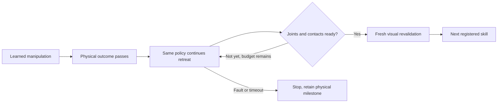

# From physical completion to the next learned skill

A placed object does not imply that the arms are ready for the next policy. The
recorded nominal workflow exposes gaps of 1.080203 rad at the bar transition and
0.551752 rad at the plate transition. A separate readiness check preserves this
distinction instead of silently starting the next checkpoint early.

`load_successor_reference(dataset_root, skill_views_path, skill_id=...)` verifies
training lineage and reads the measured joint posture at the successor's first
observation. It reads no operating targets from teacher actions. The immutable
reference records dataset/view/episode/observation digests and all twelve joints.
Load references and construct the executor before capturing live observations:
source verification can take seconds. The final fork has no successor; optional
final parking requires the loader's explicit `final_parking=True` argument.

`DinnerSkillExecutor(..., successor_reference=reference)` requires a matching
reference before starting any nonfinal task step. The reference must match the
checkpoint dataset, parent episode, current skill and registered next capability.
A final standalone skill can finish on its measured physical outcome; a provided
final parking reference adds a separate final-parking result.

When the physical monitor passes, the executor records `physical_success=true`
and keeps the same attempt, arm ownership and learned policy active. It continues
learned retreat under the existing contact, action, cancellation and timeout
checks. No reference joint values enter policy inputs or become motor targets.
Readiness consumes each confirmed action, all fifty 1 kHz physics samples, and a
fresh observation. It requires:

- All twelve joints within 0.005 rad of the verified entry reference.
- Measured joint speeds at most 0.02 rad/s for ten new consecutive observations.
- Continuous required contact/placement conditions through every physics sample,
  with valid limits, timestamps, episode, task revision and attempt identity.

These are explicit development-profile thresholds, not validated generalization
limits or organizer requirements. Hand-off must preserve receiver-only airborne
grip; placement transitions preserve all accepted placements. Drawer and utensil
transitions also preserve an open, released drawer. A failed invariant ends the
attempt. A timeout or readiness failure retains the physical-success milestone
but cannot advance the task. Queue exhaustion and elapsed time never certify
readiness. Fresh live planner revalidation is still needed before the next skill.

The combined gate and a new bar settling experiment have been checked against
retained physics evidence (results below). Existing datasets and failed runs are preserved. A
new teacher demonstration must pass the complete physical workflow before it can
be adopted; success at one transition is insufficient.

## Verified development results

Combined retained-teacher audit `20260911T041524-a18f4e1922da` is sealed and
verified: hand-off, cup, plate, drawer, spoon and final fork parking become ready.
The bar transition fails at its original view end with only six qualifying
observations. All intervening joint-limit/contact/placement checks passed for the
six ready cases. This is one existing training episode, not held-out performance.

Preregistered protocol `20260911T041036-91d3206eae36` adds exactly ten held
controls after original bar action 1569, preserving every original command and
asset. The new physics-only run `20260911T041046-acd11fe83176` **fails**: plate
rim17 contacts cabinet_right during withdrawal at simulation second 136.644.
The 1 kHz guard stops midway through the action and retains partial-action evidence.
This run cannot become a successful full-workflow demonstration.

The inserted hold separately measures maximum joint error 0.0000256 rad and
endpoint joint speed 0.0000672 rad/s, with bar placement preserved throughout
all 500 physical samples. No fresh cameras were captured, so this is a numerical
predicate check, not a live execution readiness certificate.

Sealed diagnosis `20260911T041433-5d21278da297` aligns original action indices
across the added half-second. Initial plate pose differs by only 8e-11 m; its
position difference grows to 9.05 mm during release/withdrawal. Both traces retain
left fixed-jaw/table contact then, and only the failed one reaches the cabinet.
The static joint-path guard does not predict the dynamics of a released object.
The live physics guard worked; the teacher's release clearance/robustness needs
repair under a new declared experiment. No thresholds or old data were changed.

Static clearance proposal `20260911T041924-2c2111b5399c` is sealed and verified.
The failed plate reaches the northeast vertical edge of `cabinet_right`. Moving
the proposed plate destination 20 mm north (positive Y) gives at least 15.688 mm
static clearance across sixteen restored poses; endpoint IK remains within joint
limits. This is a candidate for a separately versioned, preregistered teacher
trial with regenerated tool goals and the ten bar holds. It is not proof of a
collision-free path or stable release. The current scene and datasets remain
unchanged; a complete physical trial must pass the existing thresholds first.

## Destination-only repair attempts

The first registered repair, protocol `20260911T042704-a6719c36b78d`, retains ten
bar holds and moves the desired plate destination +20 mm Y. Tool targets are
regenerated with joint-limited IK, preserving the controlled pinch axis and
original gripper commands. This does not preserve full tool orientation on the
five-axis arm. Failed candidate `20260911T042731-bfb18f06e6f0` stops at original
control 2622, plate/lower: wrist camera versus placed cup, 0.212 mm overlap.
Its tool orientation differs by 0.05183 rad despite micrometre position error.
Diagnosis `20260911T043223-6583271ffaf0` preserves the exact scratch-pose checks.

The east20 alternative improves sampled cabinet and camera/cup clearance, but
full scratch preflight `20260911T043309-29dffffbd62f` fails at original control
2590, plate/transport: `right/collision_or_visual_7` versus `plate/rim5`.
Both preflights apply zero physics actions; neither is a manipulation success
or a new validated demonstration. Original scene, trajectories and dataset remain
unchanged. No collision predicate was relaxed.

A scratch check also rejects holding the right arm at its original home posture:
`20260911T043522-96f2ddd534c7` intersects its fixed jaw with the plate base at
control 2525, plate/transport_clearance. The earlier east20 collision is with the
right shoulder collision box at commanded joints `[1.8, -1, 0.8, 1.2, 0, 0.8]`.
Neither constant posture is a viable replacement.

Next candidate: coordinate a checked right-arm motion with the plate route. Preflight must cover the entire transition,
previously placed objects, both arms and cameras. A separate protocol and a
continuous contact-only run must pass before any new recording or dataset version.
Static margins at the destination cannot certify the route or released dynamics.

Sealed repair-design note `20260911T043714-e0cc9763cf19` retains exact measured
and commanded right-arm posture, shoulder geometry, proposed search endpoints
and required checks. It establishes no valid replacement posture or route.

## Further bounded repair evidence

Twelve fixed right-arm staging poses (`20260911T044110-b2ccb7287b2f`), three cup
relocations (`20260911T044402-fc46384331dc`), and eight timed right-arm returns
(`20260911T044606-5359e25ac580`) all fail full static preflight. None advances to
physics; no collision rules, scoring targets or production assets are changed.
These searches rule out only their recorded candidates.

Repartitioning existing preparation controls also fails the ten-observation gate:
`20260911T045024-34810b17eedb` audits boundaries 1570/1574/1580;
`20260911T045222-68516a611800` audits 1660/1670 against their own measured posture.
At the latter boundaries the gripper is still moving at 0.786 / 0.0279 rad/s,
respectively. The cup's retained physical outcome still passes, and no grasp
activity is reassigned, but the required stationary interval is absent. No new
skill-view profile was created and no old boundary was silently changed.

Release diagnosis `20260911T045528-4a0b37e4eba3` and design note
`20260911T045721-41f7350bb2c3` identify a better mechanical hypothesis: the fixed
jaw still supports the plate throughout release, with approximately 0.37 N
aggregate jaw force and plate center 19.1 mm above its flat placement center.
The commanded withdrawal is mostly west, approximately [-115, -18.63, -0.482] mm,
while the supporting jaw is on the plate's north side. Intermittent support during
this motion amplifies small differences. The next candidate should first separate
that jaw from the plate, preserving the original destination. A northward component
or controlled tilt must clear the cup, camera, table and other arm before a new
continuous physical trial. Neither alternative has been validated. Recorded
per-jaw forces are aggregates; no unrecorded tangential contact force is inferred.

## Separating-path preflight

Protocol `20260911T050717-4556f977d824` and sealed result
`20260911T050732-285490837b8c` preserve five candidates and zero physics trials.
North10/20 mm encounter camera/cup overlap. North5 mm and ±5-degree tilts pass the
separation prefix but exceed the unchanged 2.5 mm static plate-overlap limit during
retreat. This check freezes the release plate pose during the prefix, then uses
retained original plate poses during retreat. Those counterfactual overlaps do
not prove dynamic collisions; the pose approximation is an unresolved limitation.
No scene, destination, dataset or acceptance gate was changed.

## Actual northward separation prefix

The first physical diagnostic `20260911T052918-cdeba1a0c381` stopped at original
control 200 because an added static commanded-overlap heuristic rejected the
existing contact grasp. It reached no plate motion and is retained unchanged.
Corrected protocol `20260911T053053-f0e666b0363f` scopes new-motion preflight to the
separating prefix and retains the production live 1kHz contact/penetration guards.

Run `20260911T053109-6c16dbcb8104` completes 2,761 controls and 138,050 samples,
including north5 mm separation and 60 endpoint holds, then stops before the unsafe
westward retreat. It has zero forbidden contacts and 1.831 mm maximum measured
overlap. **Release fails:** fixed-jaw support persists through all 3,000 hold
samples, ending near 0.370 N; the plate remains tilted, upright cosine 0.957639,
center height 0.396589 m. Bar/cup placements and the closed drawer are preserved.
The small northward prefix is physically collision-free in this trial but does
not free the fixed jaw. No full repair, workflow or learned success follows.

A force-guided +5-degree tilt prefix was then preregistered in
`20260911T053700-b64e366625cc`. Actual run `20260911T053710-429c53f79518` again
completes all 2,761 controls/138,050 samples with no forbidden contacts, but the
fixed jaw supports the plate through the entire three-second hold. Final load
is 0.365 N, tilt 17.3 degrees, height +19.2 mm; longest transient force-free interval
is only 1 ms. Analysis `20260911T053909-574e0b62c3ed` records that static gap
prediction did not translate into sustained physical release. No repaired source
or new skill-view profile follows.

Read-only ordering analysis `20260911T054402-12a65c47f446` rejects plate-before-cup
for the existing path: the cup source creates 64 plate-path failures and blocks
both north10/20 mm prefixes from their beginning. No task order was changed.
Design `20260911T054615-6660a468f379` explains that the tilt relieved one loaded
jaw patch while pressing another. Lowering alone exhausts table clearance. The
next hypothesis combines outward edge escape with downward unloading, requiring
all loaded patches to clear. No numeric path or new physical success is validated.
